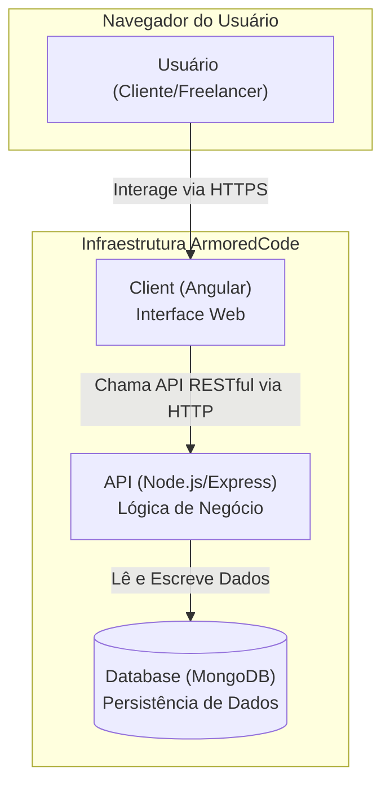

---

# ArmoredCode

<div align="center">
  
  <p><strong>Conectando talentos de desenvolvimento e empresas em Sorocaba.</strong></p>
</div>

<div align="center">
  
  
  
  
  
</div>

---

## 🚀 O Projeto

**ArmoredCode** é uma plataforma de freelancing projetada para resolver um desafio local: a dificuldade que empresas de Sorocaba, especialmente startups e PMEs, enfrentam para encontrar desenvolvedores de software qualificados na região. Ao mesmo tempo, a plataforma serve como uma ponte para estudantes e recém-formados em tecnologia, oferecendo um espaço para adquirir experiência prática, construir um portfólio robusto e se conectar com o mercado de trabalho local.

## ✨ Funcionalidades Principais

-   👥 **Perfis Duplos:** Cadastro e perfis distintos para **Clientes** (empresas) e **Freelancers** (desenvolvedores).
-   📂 **Gestão de Projetos:** Clientes podem postar projetos com descrições detalhadas, escopo, orçamento e habilidades necessárias.
-   🔍 **Busca Inteligente:** Ferramenta de busca poderosa para clientes encontrarem freelancers por habilidades e especializações, e para freelancers encontrarem projetos.
-   📝 **Sistema de Propostas:** Freelancers podem enviar propostas detalhadas para os projetos, incluindo abordagem técnica, prazos e valores.
-   💬 **Comunicação Integrada:** Um canal de chat dedicado para cada projeto, facilitando a comunicação entre cliente e freelancer desde a proposta até a conclusão.
-   📨 **Convites Diretos:** Clientes podem convidar freelancers específicos para avaliar seus projetos e enviar uma proposta.
-   ⭐ **Sistema de Avaliação:** Mecanismo de feedback e avaliação mútua (cliente e freelancer) após a conclusão de um projeto.

## 🏗️ Arquitetura

O projeto segue uma arquitetura moderna de aplicação web, separando claramente as responsabilidades entre o frontend e o backend.



## 🛠️ Tecnologias Utilizadas

| Camada    | Tecnologia                                                                                             |
| :-------- | :----------------------------------------------------------------------------------------------------- |
| **Frontend** | `Angular`, `TypeScript`, `TailwindCSS`                                                                 |
| **Backend**  | `Node.js`, `Express.js`, `Mongoose`                                                                    |
| **Banco de Dados** | `MongoDB`                                                                                              |
| **Autenticação** | `JWT (JSON Web Tokens)`                                                                                |

## 🏁 Como Rodar o Projeto Localmente

Siga os passos abaixo para configurar e executar o ambiente de desenvolvimento.

### Pré-requisitos

-   **Node.js e npm:** [https://nodejs.org/](https://nodejs.org/)
-   **Yarn:** `npm install -g yarn`
-   **MongoDB:** É necessário ter uma instância do MongoDB em execução (localmente ou na nuvem, como o MongoDB Atlas).

### Instalação

1.  **Clone o repositório:**
    ```bash
    git clone https://github.com/lucaseneiva/armoredcode.git
    cd armoredcode
    ```

2.  **Instale todas as dependências** (isso instalará para o `client` e `api`):
    ```bash
    yarn install
    ```

### Configuração do Backend

1.  Navegue até a pasta da API:
    ```bash
    cd api
    ```

2.  Crie um arquivo `.env` na raiz da pasta `api` e adicione as seguintes variáveis, substituindo os valores:
    ```env
    # String de conexão do seu banco de dados MongoDB
    MONGO_URL=<sua_string_de_conexao_do_mongodb> 
    
    # Chave secreta para gerar os tokens JWT
    JWT_SECRET=<sua_chave_secreta_jwt> 
    
    # URL do frontend (para CORS e links de e-mail)
    LIVE_URL=http://localhost:4200 
    ```

### Execução

Você precisará de dois terminais abertos.

1.  **Terminal 1: Iniciar o Backend (API)**
    A partir da raiz do projeto (`armoredcode/`), execute:
    ```bash
    yarn workspace api start
    ```
    O servidor da API será iniciado em `http://localhost:8800`. Ao iniciar, ele também irá popular o banco de dados com dados de teste (fixtures).

2.  **Terminal 2: Iniciar o Frontend (Client)**
    A partir da raiz do projeto (`armoredcode/`), execute:
    ```bash
    yarn workspace client start
    ```
    A aplicação Angular estará acessível em `http://localhost:4200`.

## 📂 Estrutura de Pastas

O repositório está organizado em um monorepo com as seguintes pastas principais:

```
└── armoredcode/
    ├── api/          # Contém todo o código do backend (Node.js/Express)
    │   ├── controllers/
    │   ├── models/
    │   ├── routes/
    │   ├── fixtures/   # Dados para popular o banco de dados
    │   └── ...
    ├── client/       # Contém todo o código do frontend (Angular)
    │   ├── src/
    │   │   ├── app/
    │   │   │   ├── components/
    │   │   │   ├── pages/
    │   │   │   └── services/
    │   └── ...
    ├── docs/         # Documentação do projeto (diagramas, exemplos)
    └── README.md     # Este arquivo
```

## 🤝 Contribuições

Contribuições são bem-vindas! Se você deseja ajudar a melhorar o ArmoredCode, sinta-se à vontade para abrir uma *issue* para discutir novas funcionalidades ou reportar bugs. Pull requests também são muito bem-vindos.

## 📄 Licença

Este projeto está licenciado sob a **GNU General Public License v3.0**. Veja o arquivo [LICENSE](LICENSE) para mais detalhes.
